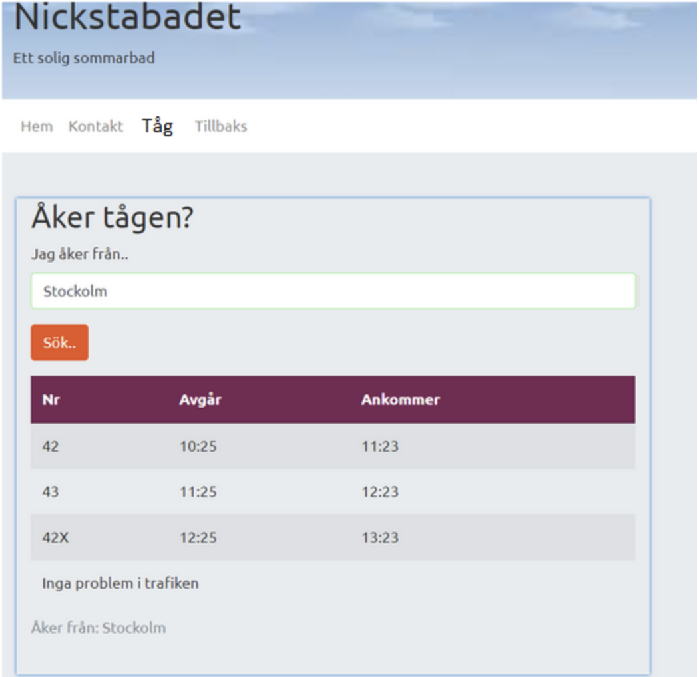

# How do I get there?
Med hjälp av trafiklabs api:et kan du skapa en personlig tågtrafik app. Det enda du behöver är tillgång till en api nyckel.

Denna övning förväntas vara klar innan nästa onsdag.

## API nyckel
Generera en API nyckel från trafiklab https://developer.trafiklab.se/
1. Registera dig i trafiklab
2. Tryck på din profil → Skapa nytt projekt
3. Skriv ett namn på projektet, exempelvis "DelayedTrafficApp"
4. Välj API:et ResRobot v2.1
5. Scrolla ner till “Taggar” skriv “demo”
6. Scrolla ner och spara projektet
7. Byt till tabben API-nycklar
8. Tryck “hämta nyckel” och godkänn terms and conditions

Du kan prova nyckeln genom att skriva in 
```https://api.resrobot.se/v2.1/location.name?input=Göteborg&format=json&accessId={DIN_NYCKEL_HÄR}```

Sidan bör visa ett långt json element.

*Observera att ibland tar det ett par minuter (tid nog för att göra mer kaffe) för en nyckel att aktiveras! Ge den lite tid om det inte fungerar första gången.*

## Design
Designen är helt valfri men bör innehålla följande.
1. Ett fält för att söka efter avgångar
2. En tabell eller liknande där avgångarna visas med deras ankomst tid

### Exempel
En bild tagen på ett liknande projekt som jag själv gjort på universitetet. Obersvera då att i den uppgiften så var avgångsplatsen given. I ert arbete bör man kunna bestäma både plats att åka från och destination.



## implementation
För att söka efter rutter mellan två platser så behöver du platsernas id-värden. Dessa hämtar du från trafiklabs lookup tjänst beskriven i följande dokumentation: https://www.trafiklab.se/api/trafiklab-apis/resrobot-v21/stop-lookup/


När du har destinationens id och platsen som du åker ifråns id så kan du använda route planner för att hämta rutter enligt dokumentationen: https://www.trafiklab.se/api/trafiklab-apis/resrobot-v21/route-planner/

*Obs detta är främst en övning i att lära sig hantera api data och göra ajax anrop. Utmaningen ligger i att förstå vilken data som du får tillbaka och att i den data filtrera ut, men hjälp av kod, den information som användaren av din app söker.*